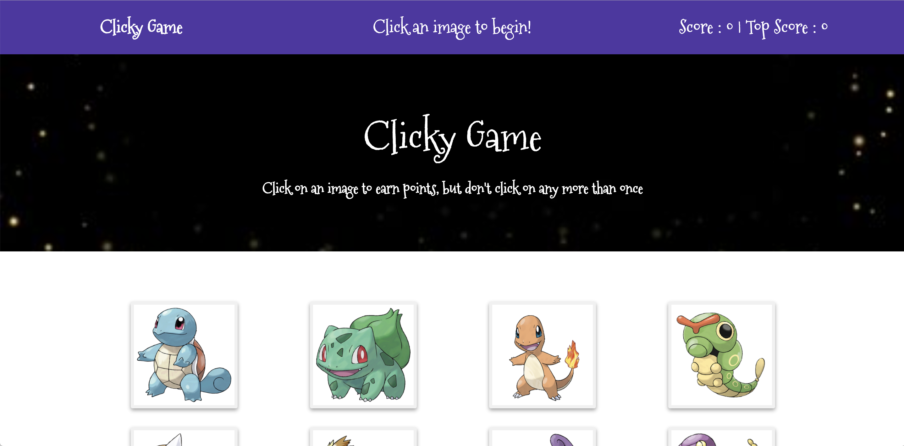

# Clicky Game
## Description
- This is a memory game with React. 

## Instruction
- click the image, but not the one that you already clicked.

## Demo
- 

## Installation
- To run the application locally, first clone this repository with the following command.

   * git clone https://github.com/lucy839/clicky-game
   * Next, install the application dependencies in the folder that you cloned the link above.
      * * npm install
   * Finally, run the server locally.
      * * npm start
   * Now, open the local application on port 8080 at the URL: http://localhost:3000/.

Enjoy the Clicky Game!
